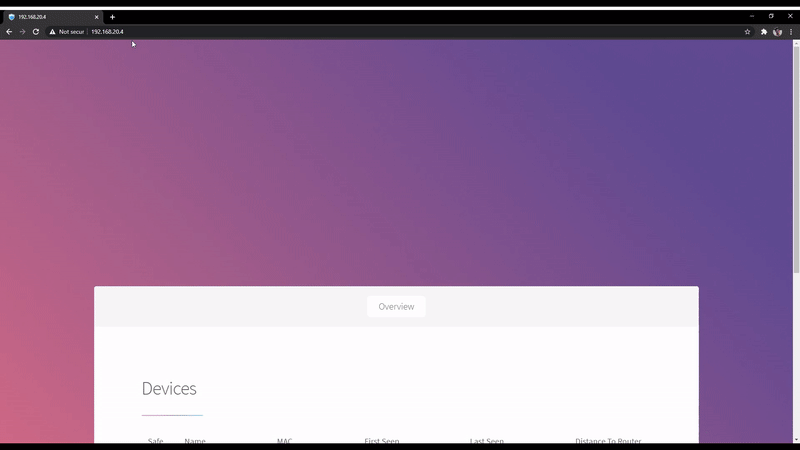

<!-- PROJECT SHIELDS -->
<!--
*** I'm using markdown "reference style" links for readability.
*** Reference links are enclosed in brackets [ ] instead of parentheses ( ).
*** See the bottom of this document for the declaration of the reference variables
*** for contributors-url, forks-url, etc. This is an optional, concise syntax you may use.
*** https://www.markdownguide.org/basic-syntax/#reference-style-links
-->

<!-- PROJECT LOGO -->
<br />
<p align="center">
  <a href="https://github.com/caelan-a/wifi-sentinel">
    
  </a>

  <h3 align="center">Wifi Sentinel</h3>

  <p align="center">
    A service that runs on a Raspberry Pi Zero to identify and log wifi devices entering your home.
    <br />
  </p>
</p>

<!-- ABOUT THE PROJECT -->
## Demo


## About The Project
Please Note: This project is for educational purposes only. This should not be used to infringe on anyone's privacy and should not leave your home. 

This project is an exploration of IoT and is completely self contained on a Raspberry Pi Zero W.

All wifi enabled devices continuously broadcast packets called probe requests to locate access points such as routers.
These probe requests are data packets which contain it's MAC address. Wifi Sentinel continously listens for these probe requests and logs them, it then cross references with devices that have connected to the same network to determine it's hostname and if it can be trusted. It serves this data in a simple dashboard running on an php enabled Apache2 webserver. 

Devices now have the ability to send randomised MAC addresses to increase user privacy (which is a good thing!). For further exploration, this project could be extended to make use of the following [paper](https://arxiv.org/abs/1703.02874v1) describing ways around this.
### Built With

* [Raspbian](https://www.aircrack-ng.org/doku.php?id=airodump-ng)
* [Aerodump-ng](https://www.aircrack-ng.org/doku.php?id=airodump-ng)
* [Nmap](https://nmap.org/)
* [Pandas](https://pandas.pydata.org/)

<!-- GETTING STARTED -->
## Getting Started

You will need a Raspberry Pi Zero W to use this project, along with an appropriate HDMI and Keyboard to connect it to your WiFi.

To get a local copy up and running follow these simple steps.

1. Download the Pi Zero W image from [](here).
2. Using [Raspberry Pi Imager](https://www.raspberrypi.org/software/) flash it onto your Pi Zero W's SD card.
3. Load the SD card and connect the Pi to power.
4. After connecting your keyboard and HDMI, login with credentials [Username: pi, Password: raspberry]
5. Edit the following file to match your home wifi network
   ```sh
   sudo nano /etc/wpa_supplicant/wpa_supplicant.conf
   ```
   ```
    network={
        ssid="testing"
        psk="testingPassword"
    }
   ```
6. Reboot
   ```sh
   sudo reboot now
   ```
7. The following service will now start up, you can tweak these in /etc/rc.local
8. Use following to find IP of pi
   ```sh
    iwconfig
   ```
9. Visit webserver using Pi's IP address

## How It Works
On startup, /etc/rc.local specifies two important processes to run as daemons:
1. Aerodump-ng which continously outputs packet data to /home/pi/wifi-sentinel/dump-**.csv
2. /home/pi/wifi-sentinel/update_known_hosts.py which updates /home/pi/wifi-sentinel/address_book.csv with MAC/ip/hostname entries for crossreferencing
3. Apache webserver at /var/www/html which uses PHP to parse the aforementioned files into user friendly information
## Resources / Knowledge
1. [Using Pi Zero W for scanning](https://medium.com/swlh/scanning-for-mobile-devices-through-wi-fi-using-pi-zero-w-8099be08cc1e)
2. [Mapping MACs to hostnames (aka Reverse ARP)](https://itsfoss.com/how-to-find-what-devices-are-connected-to-network-in-ubuntu/)
3. [Pi Zero W compatible webserver with PHP](http://www.heidislab.com/tutorials/installing-php-7-1-on-raspbian-stretch-raspberry-pi-zero-w)
## Improvements
A number of improvements could be made.
* Control of daemons from dashboard
* Easier way to connect Pi to network first time (maybe have it operate as accesspoint and use phone to setup?)
* Handle random MAC tracking

<!-- LICENSE -->
## License

Distributed under the MIT License. See `LICENSE` for more information.
